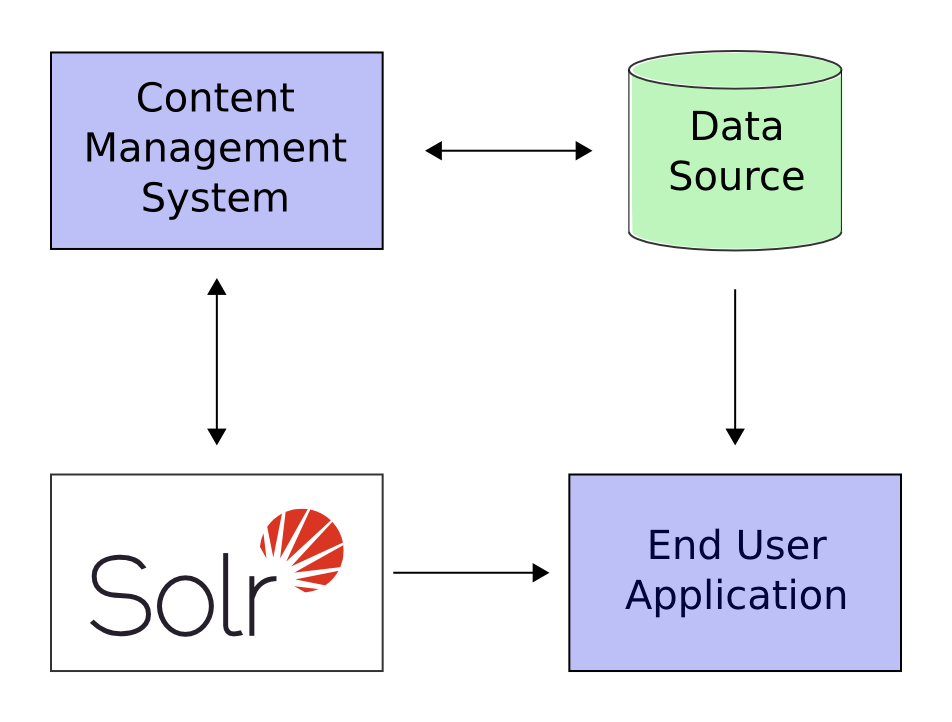

# 快速开始

## 下载 二进制 安装包


> 1.下载对应版本, 如:

```bash
wget http://mirror.bit.edu.cn/apache/lucene/solr/6.4.2/solr-6.4.2.tgz
```

> 2. 解压

```bash
tar zxf solr-x.y.z.tgz
```

## 基本操作
> 1. 启动

```bash
$cd solr
$bin/solr start
Waiting up to 180 seconds to see Solr running on port 8983 [|]
Started Solr server on port 8983 (pid=48690). Happy searching!
```

> 2. 查看 ui 界面

```bash
$open localhost:8983
```

> 3. 停止

```bash
$ bin/solr stop
```

## 启动一个示例

Solr还提供了一些有用的示例，以帮助您了解主要功能。
您可以使用-e标志启动示例。
例如，要启动“techproducts”示例

```
$ bin/solr -e techproducts
Creating Solr home directory /Users/theone/theone/solr/software/solr/example/techproducts/solr

Starting up Solr on port 8983 using command:
bin/solr start -p 8983 -s 'example/techproducts/solr'

...

{
  "responseHeader":{
    "status":0,
    "QTime":5956},
  "core":"techproducts"}

Indexing tech product example docs from /Users/theone/theone/solr/software/solr/example/exampledocs
SimplePostTool version 5.0.0
Posting files to [base] url http://localhost:8983/solr/techproducts/update using content-type application/xml...
POSTing file gb18030-example.xml to [base]

...

Solr techproducts example launched successfully. Direct your Web browser to http://localhost:8983/solr to visit the Solr Admin UI
```


## 检测状态
如果你想确认 solr 是否在运行.

```
$ bin/solr status

Found 1 Solr nodes:

Solr process 54691 running on port 8983
{
  "solr_home":"/Users/theone/theone/solr/software/solr/example/techproducts/solr",
  "version":"6.4.2 34a975ca3d4bd7fa121340e5bcbf165929e0542f - ishan - 2017-03-01 23:30:23",
  "startTime":"2017-03-16T13:27:33.288Z",
  "uptime":"0 days, 0 hours, 8 minutes, 50 seconds",
  "memory":"49.8 MB (%10.1) of 490.7 MB"}
```

## 创建一个 Core

如果你没有启动一个示例, 你需要创建一个 core, 为了能够索引和搜索.

```bash
$ bin/solr create -c <name>
```
这将创建一个核心，它使用数据驱动模式，在向索引中添加文档时尝试猜测正确的字段类型。

查看创建新 core 的所有可用选项

```bash
$ bin/solr create -help
```

## 添加文档

Solr用于查找匹配查询的文档,
Solr的 Schema(模式) 提供了如何结构化内容的概念,
在此之前,需要往里添加文档.

在此之前你可以尝试往里添加一些内容,
在 example 下有一些 案例文档.


`bin/post` 可以添加多种类型的文档.包括 xml, json, csv, 目录, (...).


`bin/post -help` 可以查看 post 帮助

```bash
$ bin/post -c gettingstarted example/exampledocs/*.xml
```

把所有的 `*.xml` 数据导入到 gettingstarted

### Ask Question

现在您已建立索引文档，您可以执行查询,
最简单的方法是构建一个包含查询参数的URL,
这结构与任何其他HTTP网址完全相同

例如, 以下实例是查询所有文档的领域中查询 'video'

```
http://localhost:8983/solr/gettingstarted/select?q=video
```

一旦掌握了查询的基本概念，就可以很容易地添加增强功能来探索查询语法。
这一个和以前一样，但每个返回结果只包含 ID, name, and price
如果不指定所需的字段，则返回所有字段

```
/select?q=video&fl=id,name,price
```
另一个例子只在`name` 字段中搜索 'black'.

```
/select?q=name:black
```

您可以提供字段的范围。以下查询查找价格介于$ 0和$ 400之间的每个文档

```
/select?q=price:[0%20TO%20400]&fl=id,name,price
```

分面浏览 是solr 关键的特征, 它允许用户以对您的应用程序有意义的方式缩小搜索结果范围.

## 快速描述

你可以通过solr 做一些有趣的事情,




例如上图, 一个在线的应用商店, 提供一个用户界面, 购物车,以及一个用户支付通道, 而库存管理将允许商店员工编辑产品信息.
产品的元数据存在某种数据库中, 以及solr 中.  

slor 可以轻松添加几个步骤,即可完成在线商店搜索:  

1. 定义一个模型, 该模式告诉 Solr 它将要建立索引的文档的内容, 在'在线商店'案例中,
    该模式将定义产品的 name, 描述, 价格, 制造商, 等.
    Solr的模式是强大和灵活的,并允许你定制Solr的行为到你的应用程序,
    查看 [Documents, Fields, and Schema Design](https://cwiki.apache.org/confluence/display/solr/Documents%2C+Fields%2C+and+Schema+Design) 详情
2. 部署 Solr
3. 您的用户将搜索的Feed Solr文档
4. 在应用程序中暴露搜索功能

因为 Solr 是一个基于开放标准,它是高度可扩展的,
solr 查询是 restful ,
这意味着,实际上,一个查询是一个简单的HTTP请求URL，响应是一个结构化文档.
主要是XML，但它也可以是JSON，CSV或一些其他格式,
这意味着各种各样的客户端都将能够使用Solr,从其他Web应用程序到浏览器客户端,以及各种应用程序.

任何能够HTTP的平台都可以与Solr通信。
查看 [Client APIs](https://cwiki.apache.org/confluence/display/solr/Client+APIs) client API 详情


Solr 是一个基于 Apache Lucene 项目, 一个高性能,多功能的搜索引擎,
Solr 支持最简单的关键字搜索到多个字段和分面搜索结果上的复杂查询.
[Searching](https://cwiki.apache.org/confluence/display/solr/Searching)有关于搜索和查询的更多信息。

## 更进一步

你已经了解了一下 Solr 的模式, 本节介绍Solr的主目录和其他配置选项。  

当Solr在应用程序服务器中运行时, 它需要访问主目录.
主目录包含重要的配置信息, 是Solr存储其索引的位置.
当在独立模式下运行Solr时, 和在SolrCloud模式下运行时, 主目录的布局看起来有点不同

Solr主目录的关键部分如下所示:
如 `solr/example/techproducts/solr`

```
# Standalone Mode
<solr-home-directory>/
   solr.xml
   core_name1/
      core.properties
      conf/
         solrconfig.xml
         managed-schema
      data/
   core_name2/
      core.properties
      conf/
         solrconfig.xml
         managed-schema
      data/

# SolrCloud Mode
<solr-home-directory>/
   solr.xml
   core_name1/
      core.properties
      data/
   core_name2/
      core.properties
      data/
```

你也许还看到其他文件,但是你需要知道:  

* solr.xml 指定Solr服务器实例的配置选项, 更多详情 [Solr Cores and solr.xml](https://cwiki.apache.org/confluence/display/solr/Solr+Cores+and+solr.xml)
* Per Solr Core:
    * core.properties 定义每个核心的特定属性，例如其名称, 核心所属的集合,模式的位置,和其他参数.有关core.properties的更多详细信息[Defining core.properties](https://cwiki.apache.org/confluence/display/solr/Defining+core.properties)
    * solrconfig.xml 控制高级行为. 例如, 您可以为数据目录指定备用位置. 有关solrconfig.xml的详细信息 [Configuring solrconfig.xml](https://cwiki.apache.org/confluence/display/solr/Configuring+solrconfig.xml)
    * 托管模式（或者schema.xml中代替） 描述您将要求Solr索引的文档。模式将文档定义为字段的集合 您可以定义字段类型和字段本身, 字段类型定义很强大，包括有关Solr如何处理传入字段值和查询值的信息。
    有关Solr模式的更多信息, 查看详情
    * data/ 包含低级索引文件的目录

请注意，SolrCloud示例不包括每个Solr Core的conf目录（因此没有solrconfig.xml或Schema文件）,
这是因为通常在conf目录中找到的配置文件存储在ZooKeeper中，因此它们可以在集群中传播。

如果您使用SolrCloud与嵌入的ZooKeeper实例, 你也许需要查看 zoo.cfg 和 zoo.data 它们是ZooKeeper配置和数据文件.

但是，如果您运行的是自己的ZooKeeper集合，您将提供您自己的ZooKeeper配置文件，当您启动它和在Solr的副本将不使用.
有关ZooKeeper和SolrCloud的详细信息，请参阅SolrCloud部分。


## Solr控制脚本参考

我们已经知道 `bin/solr` 允许 启动和停止 Solr, 创建/或删除 collections 或 cores, 对ZooKeeper进行操作，检查Solr和配置的分片的状态.
你可以在 `bin/` 目录下找到这些脚本,Solr更容易使用，`bin/solr` 脚本使得通过提供简单的命令和选项来快速实现共同目标。

下面的标题对应于可用的命令. 对于每个命令, 将使用示例描述可用的选项.

在Solr参考指南中提供了更多使用 `bin/solr` 的例子. 但特别是在运行Solr和SolrCloud入门的部分


* 启动和关闭
    * 启动
    * 关闭
* 系统信息
    * 版本
    * 状态
    * 健康检查
* Collections and Cores
    * 创建
    * 删除
* ZooKeeper操作
    * 上传配置集
    * 下载配置集
    * 在本地文件和ZooKeeper znode之间复制
    * 从ZooKeeper中删除znode
    * 将一个ZooKeeper znode移动到另一个（重命名）
    * 查看 zooKeeper 以及相关节点
    * 创建一个 z 节点


- - -
